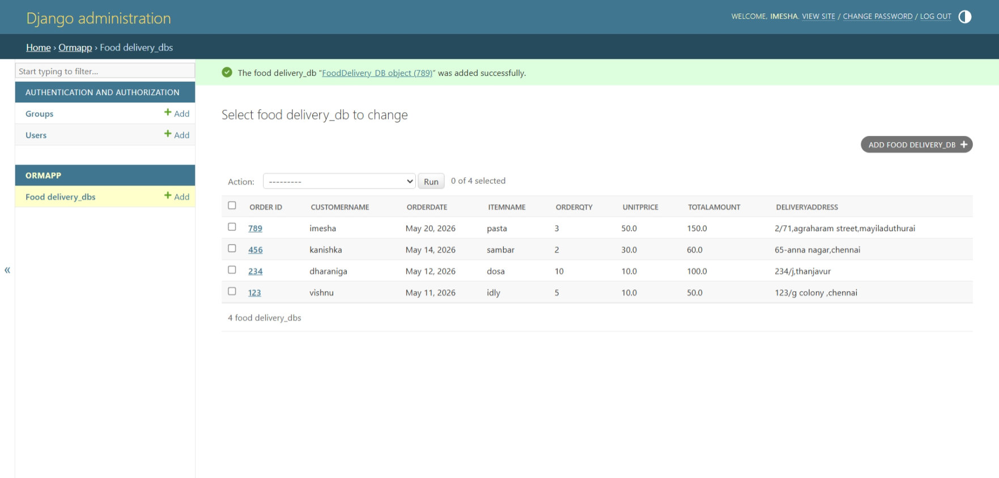

# Ex01 Django ORM Web Application
## Date: 16.05.2026

## AIM
To develop a Django application to manage an online food delivery platform like Zomato/Swiggy using Object Relational Mapping (ORM).


## DESIGN STEPS

### STEP 1:
Clone the problem from GitHub

### STEP 2:
Create a new app in Django project

### STEP 3:
Enter the code for admin.py and models.py

### STEP 4:
Execute Django admin and create details for 10 books

## PROGRAM
```
admin.py


from django.contrib import admin
from .models import FoodDelivery_DB, FoodDelivery_DBAdmin

admin.site.register(FoodDelivery_DB, FoodDelivery_DBAdmin)

models.py

from django.db import models
from django.contrib import admin

class FoodDelivery_DB(models.Model):
    Order_ID = models.IntegerField(primary_key=True)
    CustomerName = models.CharField(max_length=30)
    OrderDate = models.DateField()
    ItemName = models.CharField(max_length=100)
    OrderQty = models.IntegerField()
    UnitPrice = models.FloatField()
    TotalAmount = models.FloatField()
    DeliveryAddress = models.CharField(max_length=200)

class FoodDelivery_DBAdmin(admin.ModelAdmin):
    list_display = (
        'Order_ID',
        'CustomerName',
        'OrderDate',
        'ItemName',
        'OrderQty',
        'UnitPrice',
        'TotalAmount',
        'DeliveryAddress'
    )

```
## OUTPUT




//developed by 
Imesha.S
212225040131

## RESULT
Thus the program for creating a database using ORM hass been executed successfully
